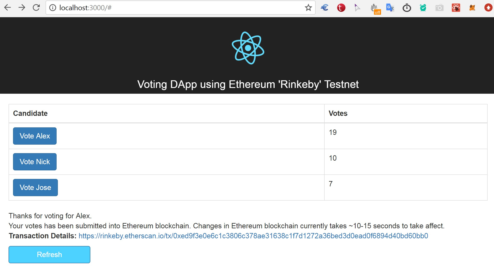

# Voting-DApp-Ethereum

Simple Voting DApp using Ethereum and React.

### 1. Screenshot:  

<h1>
    
</h1>

### 2. Ethereum local blockchain & Smart Contract Setup (Server Side)

<h1 align="center">
    
</h1>

**Some key concepts:**
#### A. Using Ethereum mainnet (Attention: Transactions cost real money !!)

...  todo

#### B. Using 'rinkeby' testnet (https://rinkeby.etherscan.io)

// Dapp:  
http://gman-mac.localdomain:3000

``` C++
//// Debug/Testing with truffle.js 
truffle console --network rinkeby
abi = <ABI of contract>;                                // Set contract ABI, See App.js
newContract = web3.eth.contract(abi);                   // Contract object
contractInstance = newContract.at('0xBc3495943e8Bc4f95068355fbE5A456ed19e7FcD');  // instance of the contract
  
web3.personal.unlockAccount('0x3B458D467156710a57bf535B7b3209CeB3AFdA7b', '.244....', 15000)
contractInstance.totalVotesFor.call(0).toLocaleString()
contractInstance.voteForCandidate(0, {from: web3.eth.accounts[0]}) // wait for transaction to finalize
contractInstance.totalVotesFor.call(0).toLocaleString()

//// Smart contract 'Voting Int 2' info on rinkeby testnet  
Addr: 0xBc3495943e8Bc4f95068355fbE5A456ed19e7FcD  
Deployed using Mist with ctor: {candidates: [0,1,2]}  
abi = ... // see App.js file  

//// Example working geth   
geth --rinkeby --syncmode "fast" --rpc --rpcapi db,eth,net,web3,personal --cache=1024 --rpcport 7545 --rpcaddr=192.168.1.253 --rpccorsdomain "*"  

//// Each voting is done by main account: 0x3b458d467156710a57bf535b7b3209ceb3afda7b  
web3.eth.getBalance("0x3b458d467156710a57bf535b7b3209ceb3afda7b")  
https://rinkeby.etherscan.io/address/0x3B458D467156710a57bf535B7b3209CeB3AFdA7b
```

#### C. Using local blockchain **ganache**

Local blockchain **ganache** creates 10 test accounts. 

``` 
web3.eth.accounts[0]
...
web3.eth.accounts[9]
```

``` C++
/// Deployment of smart contract
// This is a write operation, and web3.eth.accounts[0] pays for this transaction  
deployedContract = VotingContract.new(['Alex','Nick','Jose'],{data: byteCode, from: web3.eth.accounts[0], gas: 4700000})  

/// Vote  
// This is a write operation, and web3.eth.accounts[0] pays for this transaction  
contractInstance.voteForCandidate('Alex', {from: web3.eth.accounts[0]})  

/// Get votes  
// This is a read operation which is free  
contractInstance.totalVotesFor.call('Alex').toLocaleString()  // '1'  
```

**More:** 

``` javascript
//// 1. Setup
mkdir & cd basic-voting-app  
npm i ganache-cli web3@0.20.2  
    // ganache: in-memory blockchain (blockchain simulator)  
    //      ganache-cli creates 10 test accounts to play with automatically. 
    //      These accounts come preloaded with 100 (fake) ethers
    //      Listening on localhost:8545
    // web3 (web3.js): Ethereum JavaScript API

// Start local blockchain
node_modules/.bin/ganache-cli 


//// 2. Compile & Deploy

// Firstly run: $node

// Make sure web3 object is initialized and can communicate with simulated blockchain (ganache)
Web3 = require('web3')
web3 = new Web3(new Web3.providers.HttpProvider("http://localhost:8545"))

// Compile
code = fs.readFileSync('voting.sol').toString()
solc = require('solc')
compiledCode = solc.compile(code)

// 
abiDefinition = JSON.parse(compiledCode.contracts[':Voting'].interface)
VotingContract = web3.eth.contract(abiDefinition)
byteCode = compiledCode.contracts[':Voting'].bytecode

// Deploy
deployedContract = VotingContract.new(['Alex','Nick','Jose'],{data: byteCode, from: web3.eth.accounts[0], gas: 4700000})

// Show
deployedContract.address    
    // Save the contract address: 0xe5b458728bfd383df98353063379fa1e71855f64
contractInstance = VotingContract.at(deployedContract.address)  
    // show contract details


//// --------- 3. Interact with the contract in the nodejs console

// Vote
contractInstance.voteForCandidate('Alex', {from: web3.eth.accounts[0]})

// Get votes
contractInstance.totalVotesFor.call('Alex').toLocaleString()
    // '1'

```


#### Note/References:  
- This project is slightly modified, React version of https://medium.com/@mvmurthy/full-stack-hello-world-voting-ethereum-dapp-tutorial-part-1-40d2d0d807c2.
